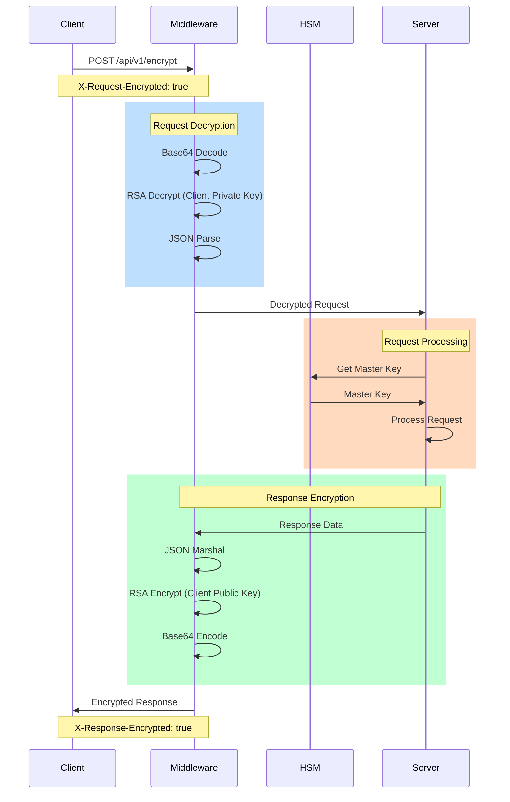

# 🔐 Xyphos Encryption Documentation

## Overview

Xyphos provides end-to-end encryption for client-server communication using RSA-OAEP encryption. This ensures that sensitive data remains secure during transit.

## Key Features

- 🔑 4096-bit RSA key pairs for strong security
- 🔒 Request/response encryption using RSA-OAEP with SHA-256
- 📦 Base64 encoding for encrypted data transport
- 🔄 Automatic key rotation support
- 🛡️ Per-client encryption keys
- 🏢 Location-based master keys (Current)
- 🔜 Project-based master keys (Coming Soon)

## Master Key Architecture

### Current: Location-Based Master Keys
- Master keys are managed at the location level
- Provides geographic isolation and compliance
- All projects in a location share the same master key
- Automatic rotation with 24-hour grace period

### Future: Project-Based Master Keys
- Each project will have its own master key
- Enhanced isolation between projects
- Independent key rotation schedules
- Automatic synchronization with location keys
- Project-specific audit trails
- Backward compatibility with location-based keys

## Client Configuration

Each client gets its own RSA key pair during client configuration creation:

```go
config, err := client.CreateClientConfig(ctx, "my-client", []string{"encrypt", "decrypt"})
// Store config.PrivateKey securely - it's only sent once during creation
```

## 🔄 Request/Response Flow

### Detailed Flow Diagram


### Code Flow

1. **🔒 Incoming Request Processing**:
```go
// 1. Check for encrypted request header
if c.GetHeader("X-Request-Encrypted") == "true" {
    // 2. Read and validate request body
    body, err := io.ReadAll(c.Request.Body)
    
    // 3. Base64 decode
    decodedBody, err := base64.StdEncoding.DecodeString(string(body))
    
    // 4. Decrypt using client's private key
    decryptedBody, err := m.securityService.DecryptFromClient(
        clientConfig.PrivateKey, 
        decodedBody
    )
    
    // 5. Parse JSON if applicable
    if decryptedBody[0] == '{' || decryptedBody[0] == '[' {
        var jsonBody any
        json.Unmarshal(decryptedBody, &jsonBody)
    }
}
```

2. **🔐 Response Encryption**:
```go
// 1. Capture response in custom writer
writer := &responseWriter{
    ResponseWriter: c.Writer,
    status:        http.StatusOK,
}

// 2. Process request
c.Next()

// 3. Check for encryption header
if c.GetHeader("X-Response-Encrypted") == "true" {
    // 4. Encrypt response for client
    encryptedData, err := m.securityService.EncryptForClient(
        clientConfig.PublicKey, 
        writer.body
    )
    
    // 5. Base64 encode
    encodedData := base64.StdEncoding.EncodeToString(encryptedData)
    
    // 6. Send encrypted response
    c.Header("Content-Type", "application/octet-stream")
    c.Header("X-Response-Encrypted", "true")
    c.String(writer.status, encodedData)
}
```

### 🔑 Key Usage Flow

1. **Current: Location-Based**
```
Request -> Location Master Key -> HSM -> Operation -> Response
```

2. **Future: Project-Based**
```
Request -> Project Master Key -> Location Master Key -> HSM -> Operation -> Response
```

## Request Flow

1. **Client-side Encryption**:
   ```typescript
   // TypeScript example
   const client = new XyphosClient({
     baseURL: "http://localhost:8080",
     clientConfigId: config.id,
     clientConfigSecret: config.secret,
     privateKey: storedPrivateKey  // From client config creation
   });

   // Request is automatically encrypted
   const result = await client.encrypt(projectId, locationId, keyringId, keyId, plaintext);
   ```

2. **Server-side Decryption**:
   - Middleware automatically detects encrypted requests via `X-Request-Encrypted` header
   - Decrypts using client's private key stored on server
   - Processes decrypted request
   - Encrypts response if needed

## Headers

- `X-Request-Encrypted: true` - Indicates request body is encrypted
- `X-Response-Encrypted: true` - Indicates response body is encrypted

## Encryption Process

1. **Request Encryption**:
   ```
   [Request Body] -> JSON -> RSA-OAEP -> Base64 -> [Transport]
   ```

2. **Response Decryption**:
   ```
   [Response Body] -> Base64 Decode -> RSA-OAEP Decrypt -> JSON -> [Data]
   ```

## Client Libraries

### Go Client

```go
client := kms.NewClient(kms.ClientConfig{
    BaseURL: "http://localhost:8080",
    ClientConfigID: config.ID,
    ClientConfigSecret: config.Secret,
    PrivateKey: storedPrivateKey,
})

// Encryption happens automatically
result, err := client.Encrypt(ctx, projectID, locationID, keyringID, keyID, plaintext)
```

### Python Client

```python
client = XyphosClient(ClientConfig(
    base_url="http://localhost:8080",
    client_config_id=config.id,
    client_config_secret=config.secret,
    private_key=stored_private_key
))

# Encryption happens automatically
result = client.encrypt(project_id, location_id, keyring_id, key_id, plaintext)
```

### TypeScript Client

```typescript
const client = new XyphosClient({
  baseURL: "http://localhost:8080",
  clientConfigId: config.id,
  clientConfigSecret: config.secret,
  privateKey: storedPrivateKey
});

// Encryption happens automatically
const result = await client.encrypt(projectId, locationId, keyringId, keyId, plaintext);
```

## Security Considerations

1. **Key Storage**:
   - Store private keys securely
   - Never log or expose private keys
   - Use environment variables or secure key storage solutions
   - Separate storage for project and location master keys

2. **Key Rotation**:
   - Rotate client keys periodically
   - Implement key version tracking
   - Handle key rotation gracefully in applications
   - Coordinate project and location key rotations

3. **Error Handling**:
   - Handle encryption/decryption errors gracefully
   - Don't expose sensitive information in error messages
   - Log encryption failures securely
   - Track master key usage patterns

## Best Practices

1. **Always Use HTTPS**:
   - Even with request encryption, always use HTTPS
   - Encryption provides additional security layer

2. **Key Management**:
   - Implement secure key storage
   - Regular key rotation
   - Key backup and recovery procedures
   - Plan for project-based key migration

3. **Monitoring**:
   - Monitor encryption/decryption failures
   - Alert on suspicious patterns
   - Track key usage and rotation
   - Audit project-specific key operations

4. **Project Key Migration (Coming Soon)**:
   - Plan for gradual migration to project keys
   - Test migration procedures
   - Monitor migration progress
   - Maintain backward compatibility
   - Document migration steps

## Testing

Run the encryption tests:

```bash
go test -v ./internal/api/middleware/encryption_test.go
```

The tests cover:
- Basic request/response flow
- Encryption/decryption process
- Error handling
- Invalid encryption scenarios 