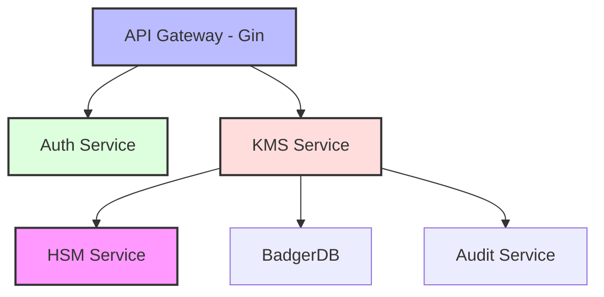
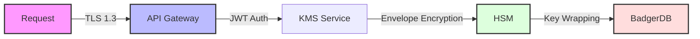

# 🔐 Xyphos Server

> Why did the cryptographer bring a ladder to work? Because they heard the encryption keys were stored at a higher level! 🪜

A secure, multi-tenant key management system built in Go. Think Google Cloud KMS, but open source and running in your own infrastructure! 

[](https://goreportcard.com/report/github.com/theboringhumane/xyphos)
[](https://opensource.org/licenses/MIT)

## 🌟 Features

- 📦 Hierarchical key structure (Projects > Locations > KeyRings > CryptoKeys > Versions)
- 🏢 Multi-tenant isolation with project-based access control
- 🔄 Automatic key rotation with configurable crypto periods
- 🔒 FIPS 140-2 compliant crypto operations (AES-256-GCM, RSA-OAEP, ECDSA)
- 🔑 GitHub OAuth + JWT-based API authentication
- 📝 Tamper-evident audit logging with HMAC-SHA256 chain
- 💾 Secure key storage with BadgerDB and envelope encryption

## 🏗️ Architecture



### 📂 Project Structure

```
.
├── cmd/                    # Application entrypoints
│   └── main.go            # Main server
├── internal/              # Private application code
│   ├── api/              # HTTP handlers and routing
│   ├── auth/             # Authentication and authorization
│   ├── hsm/              # Hardware Security Module simulation
│   ├── models/           # Data models
│   └── store/            # Data storage (BadgerDB)
├── data/                 # BadgerDB data directory
└── .env                  # Environment configuration
```

## 🚀 Quick Start

> Why do developers prefer dark mode? Because light attracts bugs! 🪲

### Prerequisites

- 🐹 Go 1.21+
- ☕ Coffee (lots of it!)

### Setup

1. Clone and install:
```bash
git clone https://github.com/theboringhumane/xyphos.git
cd xyphos
go mod download
```

2. Set up environment:
```bash
cp .env.example .env
# Generate JWT secret
openssl rand -base64 32  # Copy to JWT_SECRET in .env
```

3. Run the server:
```bash
go run cmd/main.go
```

## 🔐 Security Architecture



### 🔑 Key Hierarchy

The system follows a hierarchical structure for key management:

1. **Projects**
   - Top-level organizational unit
   - Multi-tenant isolation
   - Access control boundary

2. **Locations**
   - Geographic regions
   - Data residency compliance
   - Regional failover support

3. **Key Rings**
   - Logical grouping of keys
   - Application-specific isolation
   - Shared access policies

4. **Crypto Keys**
   - Actual encryption keys
   - Version management
   - Automatic rotation
   - Purpose-specific usage

5. **Key Versions**
   - Immutable key material
   - Time-based validity
   - Automatic expiration

## 📚 API Documentation

For detailed API documentation, visit the [API Reference](../api/README.md) or run the Swagger UI locally:

```bash
make serve-docs
# Visit http://localhost:8088/swagger-ui/
```

## 🧪 Testing

```bash
# Run all tests
go test ./...

# Run with coverage
go test -coverprofile=coverage.out ./...
go tool cover -html=coverage.out
```

## 🤝 Contributing

> How many developers does it take to implement a crypto algorithm? None, they should use the standard library! 🔐

Contributions are welcome! Please read our [Contributing Guide](../../CONTRIBUTING.md) first.

## 📝 License

MIT License - see [LICENSE](../../LICENSE)

## 🧑‍💻 Author

Created with ❤️ by [Harsh VARDHAN GOSWAMI](https://github.com/theboringhumane)

> Why did the cryptographer get locked out? They used ROT13 on their password! 🔄

---
*Remember: Never roll your own crypto! 🎲* 