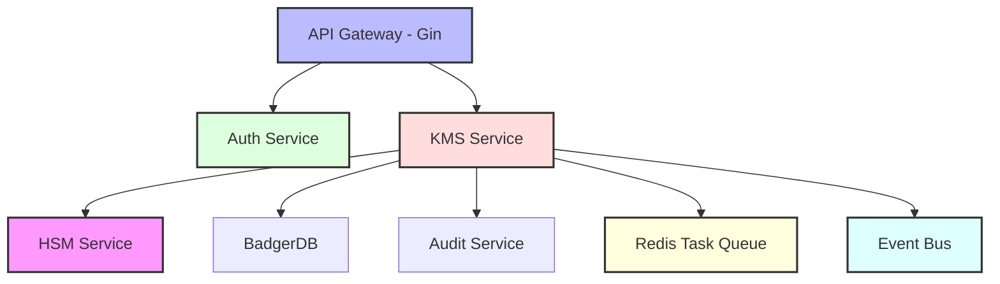

# 🔐 Xyphos Server

> Why did the cryptographer bring a ladder to work? Because they heard the encryption keys were stored at a higher level! 🪜

A secure, multi-tenant key management system built in Go. Think Google Cloud KMS, but open source and running in your own infrastructure! 

[](https://goreportcard.com/report/github.com/theboringhumane/xyphos)
[](https://opensource.org/licenses/MIT)

## 🌟 Features

- 📦 Hierarchical key structure (Projects > Locations > KeyRings > Tenants > CryptoKeys > Versions)
- 🏢 Enhanced multi-tenant isolation with tenant-based access control
- 🔄 Asynchronous key rotation with Redis-backed task queue
- 🔒 FIPS 140-2 compliant crypto operations (AES-256-GCM, RSA-OAEP, ECDSA)
- 🔑 OAuth2 client credentials + JWT-based API authentication
- 📝 Tamper-evident audit logging with HMAC-SHA256 chain
- 💾 Secure key storage with BadgerDB and envelope encryption
- 🎯 Event-driven architecture with async event bus
- 🔐 Master key rotation with backward compatibility
- 📊 Enhanced tenant management and monitoring

## 🏗️ Architecture



### 📂 Project Structure

```
.
├── cmd/                    # Application entrypoints
│   └── main.go            # Main server
├── internal/              # Private application code
│   ├── api/              # HTTP handlers and routing
│   ├── auth/             # Authentication and authorization
│   ├── hsm/              # Hardware Security Module simulation
│   ├── models/           # Data models
│   ├── store/            # Data storage (BadgerDB)
│   ├── events/           # Event bus system
│   └── tasks/            # Async task processing
├── data/                 # BadgerDB data directory
└── .env                  # Environment configuration
```

## 🚀 Quick Start

### Prerequisites

- 🐹 Go 1.21+
- 📦 Redis 6.0+ (for task queue)
- ☕ Coffee (lots of it!)

### Setup

1. Clone and install:
```bash
git clone https://github.com/theboringhumane/xyphos.git
cd xyphos
go mod download
```

2. Set up environment:
```bash
cp .env.example .env
# Generate JWT secret
openssl rand -base64 32  # Copy to JWT_SECRET in .env
# Set Redis connection
REDIS_ADDR=localhost:6379
# Set master key folder
MASTER_KEY_FOLDER=/var/lib/xyphos
```

3. Create master key folder:
```bash
make create-master-key-folder
```

4. Run the server:
```bash
make run
```

## 🔐 Security Architecture

### 🔑 Key Hierarchy

The system follows an enhanced hierarchical structure for key management:

1. **Projects**
   - Top-level organizational unit
   - Multi-tenant isolation
   - Access control boundary
   - Future: Project-specific master keys (Coming Soon!)

2. **Locations**
   - Geographic regions
   - Data residency compliance
   - Regional failover support
   - Current: Location-based master key management

3. **Key Rings**
   - Logical grouping of keys
   - Application-specific isolation
   - Shared access policies

4. **Tenants** (New!)
   - Tenant-specific key isolation
   - Independent key management
   - Custom rotation policies
   - Access control boundary

5. **Crypto Keys**
   - Actual encryption keys
   - Version management
   - Automatic rotation
   - Purpose-specific usage

6. **Key Versions**
   - Immutable key material
   - Time-based validity
   - Automatic expiration
   - Backward compatibility

### 🔄 Key Rotation

The system now features enhanced key rotation capabilities:

1. **Asynchronous Rotation**
   - Redis-backed task queue
   - Scheduled rotations
   - Automatic retry mechanism
   - Failure handling

2. **Master Key Rotation**
   - Location-specific master keys
   - Automatic re-encryption
   - Version tracking
   - 24-hour grace period

3. **Tenant Key Rotation**
   - Independent rotation schedules
   - Custom rotation periods
   - Version deprecation
   - Access policy enforcement

## 🚀 Future Plans

### 🔐 Project-Based Master Keys
Currently, master keys are managed at the location level for geographic isolation. In the next major update, we're introducing project-level master keys to provide:

- 🏢 Enhanced project isolation
- 🔒 Project-specific key rotation policies
- 🎯 Independent key lifecycle management
- 🛡️ Project-level encryption boundaries
- 🔄 Automatic synchronization with location keys
- 📊 Project-specific audit trails

This enhancement will allow organizations to maintain complete isolation between projects while still leveraging location-based compliance features.

## 📚 API Documentation

### New Tenant Management Endpoints

```http
# Create a new tenant
POST /projects/{project_id}/locations/{location_id}/keyrings/{keyring_id}/tenants
Content-Type: application/json

{
    "name": "my-tenant",
    "description": "My tenant description",
    "labels": {
        "env": "prod"
    }
}

# List tenants
GET /projects/{project_id}/locations/{location_id}/keyrings/{keyring_id}/tenants

# Get tenant
GET /projects/{project_id}/locations/{location_id}/keyrings/{keyring_id}/tenants/{tenant_id}

# Update tenant
PUT /projects/{project_id}/locations/{location_id}/keyrings/{keyring_id}/tenants/{tenant_id}
Content-Type: application/json

{
    "name": "updated-tenant-name",
    "description": "Updated description"
}
```

For complete API documentation, visit the [API Reference](../api/README.md) or run the Swagger UI locally:

```bash
make serve-docs
# Visit http://localhost:8088/swagger-ui/
```

## 🧪 Testing

```bash
# Run all tests
go test ./...

# Run with coverage
go test -coverprofile=coverage.out ./...
go tool cover -html=coverage.out
```

## 🤝 Contributing

> How many developers does it take to implement a crypto algorithm? None, they should use the standard library! 🔐

Contributions are welcome! Please read our [Contributing Guide](../../CONTRIBUTING.md) first.

## 📝 License

MIT License - see [LICENSE](../../LICENSE)

## 🧑‍💻 Author

Created with ❤️ by [Harsh VARDHAN GOSWAMI](https://github.com/theboringhumane)

> Why did the cryptographer get locked out? They used ROT13 on their password! 🔄

---
*Remember: Never roll your own crypto! 🎲* 